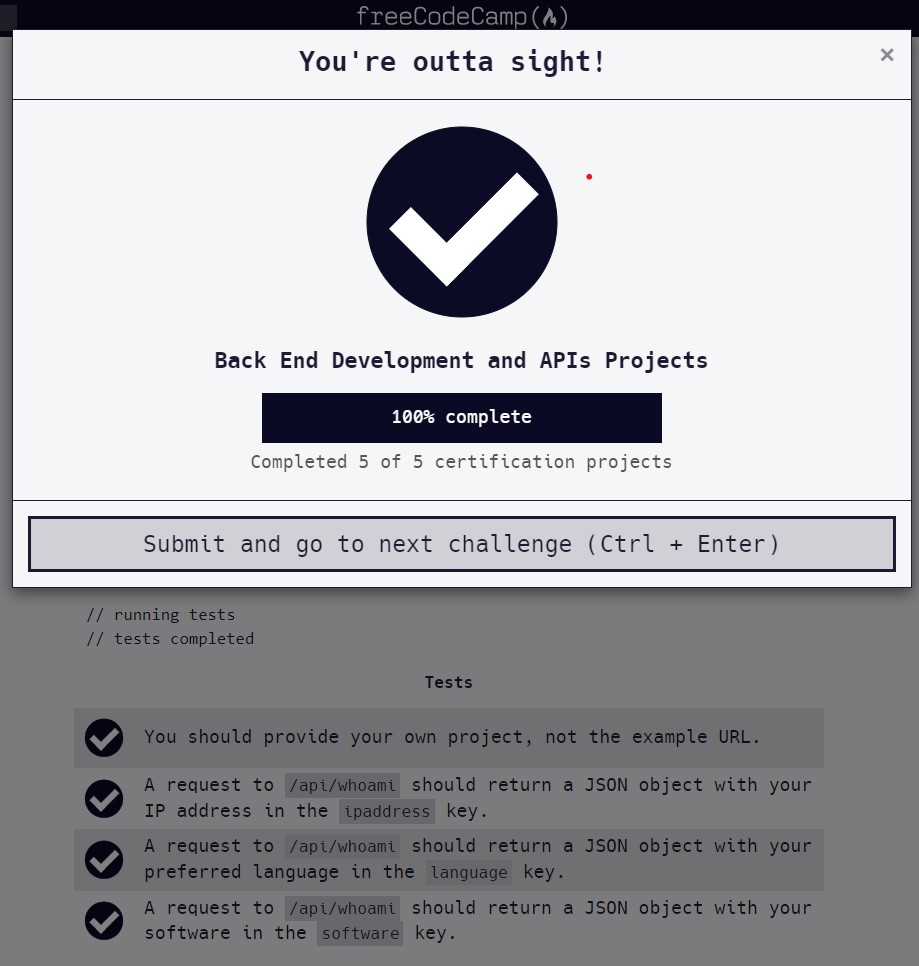

# Request Header Parser Microservice
#### Solution running on : https://replit.com/@ViktoriusSuwand/Request-Header-Parser-MicroserviceProject-5

This is the boilerplate to complete the Request Header Parser Microservice project. Instructions for building this project can be found at 
https://www.freecodecamp.org/learn/apis-and-microservices/apis-and-microservices-projects/request-header-parser-microservice

###  Some of additional features :
     * using req.header to get user language
     * using req.header to get user software
     * using req.ip to get user ip

### Test Scenario :
- You should provide your own project, not the example URL.
- A request to `/api/whoami` should return a JSON object with your `IP address` in the ipaddress key.
- A request to `/api/whoami` should return a `JSON object` with your preferred language in the `language` key.
- A request to `/api/whoami` should return a `JSON object` with your software in the `software` key.

### Test Result

